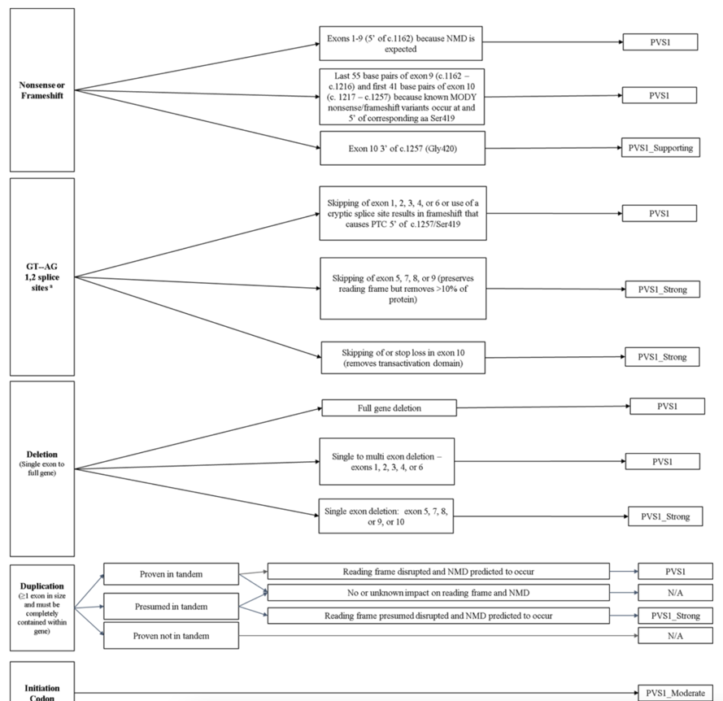

**HNF4A** The protein encoded by this gene is a nuclear transcription factor which binds DNA as a homodimer.
The encoded protein controls the expression of several genes, including hepatocyte nuclear factor 1 alpha,
a transcription factor which regulates the expression of several hepatic genes. This gene may play a role in development
of the liver, kidney, and intestines. Mutations in this gene have been associated with monogenic autosomal dominant 
non-insulin-dependent diabetes mellitus type I. Alternative splicing of this gene results in multiple transcript 
variants encoding several different isoforms. [provided by RefSeq, Apr 2012]

The ClinGen community have specific flowchart to classify HNF4A variants as PVS1

 

This script was build to solve part of the flowchart complexity, the first block to ve specific 
This app will pull variant info from VEP API, look at the exon number, variant consequence, cds end and will assess if the variant provided meets the PVS1 
OR NOT.In addition, this app will also get the gene name and protein effect

**1) Install the required modules** that are in the requirements file 
2) You can either copy the code into your local machine or pull the repo 
3) The code name is FINAL_HNF4A_Code.py 
4) Run the code in your preferred Python environment, and follow the prompts to enter your variant ID.
5) The code will retrieve information on the most severe consequence of the variant from the Ensembl REST API. 
It will then check if the variant meets the PVS1 criteria for the HNF4A gene. If it does, it will output 
a message indicating the level of support for PVS1 criteria. If it does not meet the criteria, 
it will output a message indicating that the variant does not meet PVS criteria.
6) The code will then retrieve information on the protein, MANE select transcript, 
and gene name from the Variant Validator REST API. It will output the information retrieved.
7) The code will log any errors that occur during the process. The log file will be named "logging.log"
and will be located in the same directory as the Python file.
8) If there is an error in the VEP API call, the user will be prompted to enter the variant ID again.

**Note:** This code assumes that you have access to the Ensembl REST API and the Variant Validator REST API. 
If you do not have access, the code will not work as intended. This code will on work for variants 
described **in HGVS and GRCh38.** 

This app was tested and validated on the following variants: 
Pathogenic missense variant that does not meet PVS1 criteria - NM_175914.5(HNF4A):c.187C>T (p.Arg63Trp)
NC_000020.11:g.44406195C>T

Likely benign synonymous variant, does not meet PVS1 criteria - NM_175914.5(HNF4A):c.1017C>T (p.Phe339=)
NC_000020.11:g.44424208C>T

Hi Ghadir, sorry for the delayed response. These nonsense variants are all Pathogenic and satisfy the PVS1 criterion at very strong level:

NM_175914.5(HNF4A):c.48C>A (p.Tyr16Ter)
NC_000020.11:g.44355852C>A

NM_175914.5(HNF4A):c.352C>T (p.Arg118Ter)

NC_000020.11:g.44413726C>T

NM_175914.5(HNF4A):c.265C>T (p.Gln89Ter)
NC_000020.11:g.44407421C>T